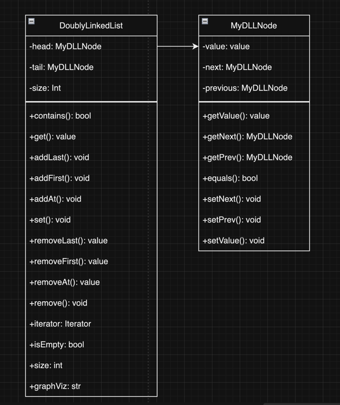
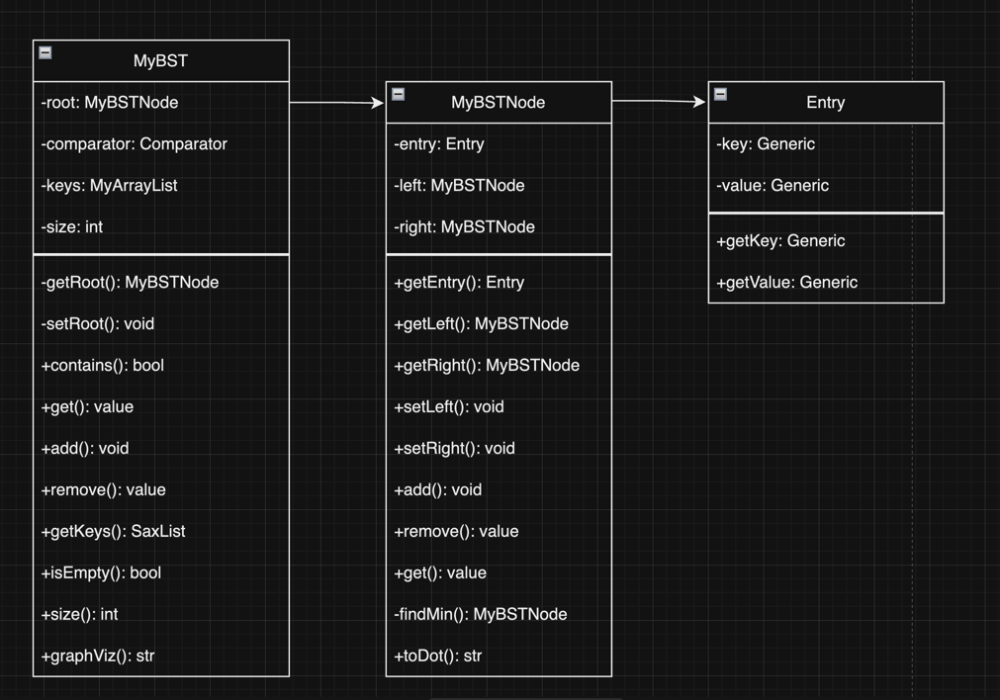
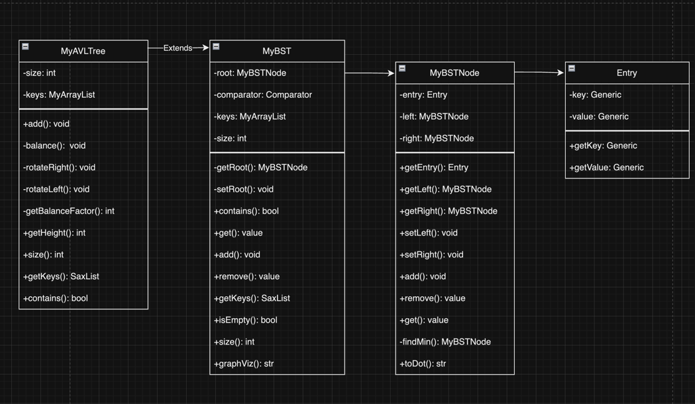
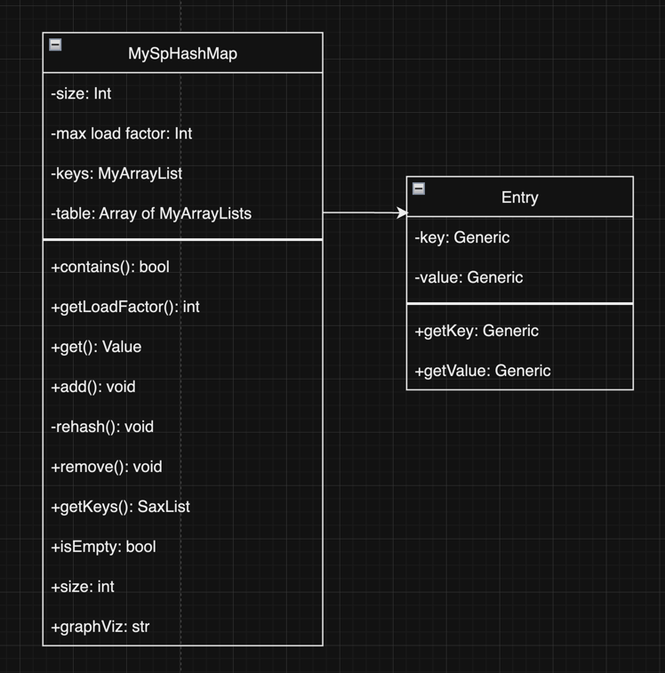
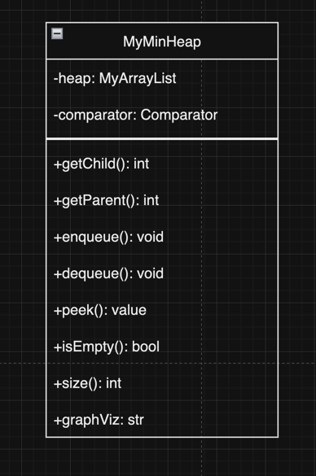
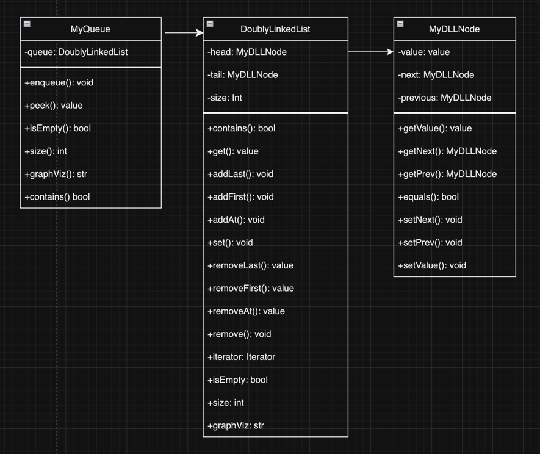
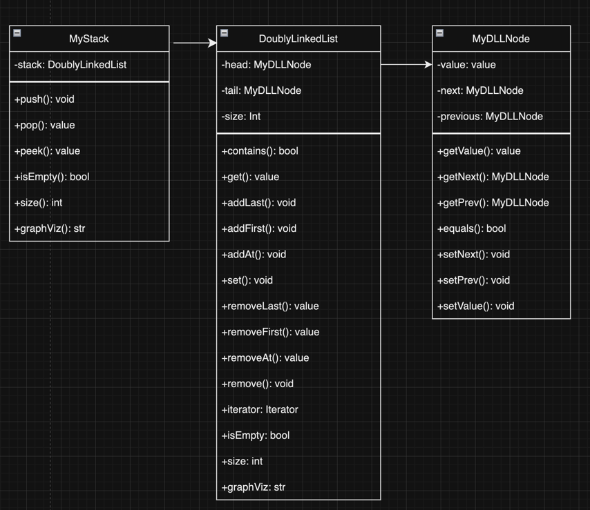
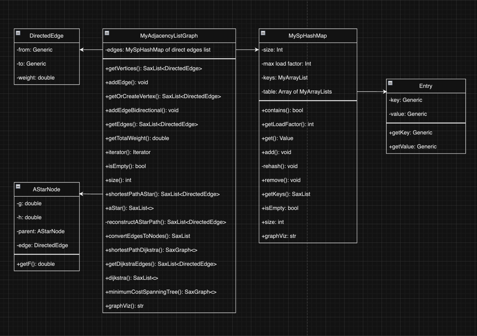
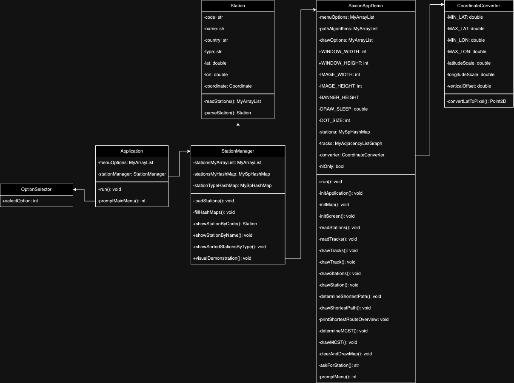

# Algorithms and classes

## MijnArrayList
**Class Diagram:**
Teacher implemented this class for us, so I didn't have to create it myself.

**Implementation:** [mijn implementatie](../src/nl/saxion/cds/solution/data_structures/MyArrayList.java)

As I started building my own utility Csv Reader, based on the ArrayList, I had to add one additional method `clear()`.
This needed  as I had to clear my own list instance on every line read. Otherwise, it would be eventually filled with all the data from the file and reading column by index wouldn't work properly.
This method simply sets the size of the list to 0 and internal array to default minimum size.

#### Testing
**Test file:** [MyArrayListTest](../test/nl/saxion/cds/solution/data_structures/MyArrayListTest.java)

## DoublyLinkedList

**Class Diagram:**

**Implementation:** [my implementation](../src/nl/saxion/cds/solution/data_structures/DoublyLinkedList.java);

Implementing a doubly linked list was the assignment of the first week to get a fresh reminder of the basic data structures.
In the last year, on "Introduction to Algorithms and Data Structures" I already implemented both Singly, Doubly and Circular linked list structures, which helped me to get started quickly.
I have rewritten most of the code myself, but it is still very much similar to my previous implementation.
I was confused with method `remove()` at first, as it wasn't clear if it should remove the first encountered element or all of them. In the end, I decided to make it remove only the first encounter, leaving possibility of adding `removeAll()` method in a future, which will remove all occurrences of the given element.

I have had some troubles with `graphViz()` method as I have never used `DOT` language before. 
After spending some time reading the documentation and still not being able to visualize the nodes, I began to surf through internet. 
I stumbled upon a [stack overflow post](https://stackoverflow.com/questions/70441786/draw-doubly-linked-list-using-graphviz)  where I found a script for visualizing doubly linked list.
After that I have used chatGPT to achieve getting same script output based on elements inside my list.

#### Explanation
By using a `MyDLLNode` class, it is possible to create connections between nodes and form a list. We track head, tail and size of the list. In methods `addFirst()`, `addLast()` and `remove()` we adjust the pointers accordingly.

#### Testing
**Test file:** [DoublyLinkedListTest](../test/nl/saxion/cds/solution/data_structures/DoublyLinkedListTest.java)

When it comes to testing, I have tested every method with multiple test cases, including edge cases.
I went a bit overboard and tested every method with multiple test cases.
I have achieved 100% coverage just out of curiosity, but I believe it was a good practice to do so.

## My binary search algorithm
**Classification:** `O(Log(N))`

It is `O(Log(N))` because it has to divide the array in half log(N) times to find the element.

I have implemented binary search during the lecture, as our teacher were explaining the algorithm and showed us some pseudocode.
The whole concept is fairly straightforward, but I always messed up the indexes.

#### Explanation
The binary search algorithm works by dividing the array in half and checking if the element is in the left or right half. If it is in the left half, we repeat the process with the left half, otherwise with the right half.
We keep dividing the array in half until we find the element or the array is empty.

#### Testing
Method is tested within the `MyArrayList` class
**Test file:** [MyArrayListTest](../test/nl/saxion/cds/solution/data_structures/MyArrayListTest.java)

## My linear search algorithm
**Classification:** `O(N)`

It is O(N) because it has to go through the whole input N to find the element.

The linear search was already implemented in the `MyArrayList` class, so I didn't have to implement it again.
It is by far the simplest search algorithm and I have used it many times before.

#### Explanation
The linear search algorithm works by iterating over the whole array and checking if the element is equal to the searched element.

#### Testing
Method is tested within the `MyArrayList` class
**Test file:** [MyArrayListTest](../test/nl/saxion/cds/solution/data_structures/MyArrayListTest.java)

## My QuickSort algorithm
**Classification:** `O(N log(N))`

Quicksort is `O(N log(N))` because it works by repeatedly splitting the list into smaller halves, which takes log N steps. Then it sorts each part, which takes N.

I had the most struggles with the QuickSort algorithm. It is beautiful and elegant, I was getting the concept, but I just couldn't wrap my head around the implementation.
I have spent more than two hours watching videos on YouTube and it was getting more and more confusing, because apparently there is different ways to implement it.

I have finally found a course on Algorithms, given by famous engineer and blogger PrimeAgen. He had taught his own course on algorithms, and luckily there were two lectures dedicated to it.
I found his explanation the best to me. He implemented algorithm with the audience using TypeScript and used pivot as the last element.
However, in our implementation we had to use the first element as a pivot. I have adjusted the code accordingly and tested it with multiple test cases. 

Reference: [PrimeAgen QuickSort](https://frontendmasters.com/courses/algorithms/)

#### Explanation
The QuickSort algorithm works by selecting a pivot element and partitioning the array around the pivot. All elements smaller than the pivot are moved to the left of the pivot, and all elements greater are moved to the right. 
The pivot is then in its final position. This process is repeated for the left and right halves.

#### Testing
Method is tested within the `MyArrayList` class
**Test file:** [MyArrayListTest](../test/nl/saxion/cds/solution/data_structures/MyArrayListTest.java)

## My selectionSort algorithm

**Classification:** `O(n^2)`

It's `O(n^2)` because it has two nested loops.
One loop to select an element of Array one by one
Another loop to compare that element with every other Array element

We were given a choice to implement either selection or insertion sort. I have decided to try both.
It was fairly easy, but I still had to watch explanatory video on YouTube to get the concept right.

#### Explanation
The selection sort algorithm works by selecting the smallest element from the array and swapping it with the first element. Then it selects the second smallest element and swaps it with the second element, and so on.

#### Testing
Method is tested within the `MyArrayList` class
**Test file:** [MyArrayListTest](../test/nl/saxion/cds/solution/data_structures/MyArrayListTest.java)

## My insertionSort algorithm

**Classification:** `O(n^2)`

It is `O(n^2)` because it also has two nested loops.
One loop to select an element of the array one by one.
Another loop to compare that element with the already sorted elements in the array and shift them if needed.

I have implemented insertion sort as well, as I wanted to try both sorting algorithms. It was a bit more challenging to me than selection sort, but I have managed to implement it 
also with help of YouTube videos.

#### Explanation
The insertion sort algorithm works by selecting the first element and comparing it with the second element. If the second element is smaller, it is swapped with the first element. Then the third element is compared with the first and second element and so on.

#### Testing
Method is tested within the `MyArrayList` class
**Test file:** [MyArrayListTest](../test/nl/saxion/cds/solution/data_structures/MyArrayListTest.java)

## My BST

**Class Diagram**: 

**Implementation:** [my implementation](../src/nl/saxion/cds/solution/data_structures/MyBST.java);

I have created a normal binary search tree (without balancing) first to refresh my memory on how it works.
I have struggled the most with `.remove()` method and had to watch a couple of tutorials to get the concept right.
At the end of the day, I have managed to implement it and test all possible cases, achieving 100% coverage.

#### Explanation
The binary search tree works by inserting elements in a sorted order. If the element is smaller than the root, it is considering left side, comparing it with every node until it finds the right spot. If the element is greater, it is considering right side.

#### Testing
**Test file:** [MyBSTTest](../test/nl/saxion/cds/solution/data_structures/MyBSTTreeTest.java)

## My AVL
**Class Diagram**:

**Implementation:** [my implementation](../src/nl/saxion/cds/solution/data_structures/MyAVLTree.java);

This was by far the most challenging task for me. During the lectures, I thought I understood it, however I couldn't wrap my head around actual implementation.

I have spent roughly 4 hours watching tutorials and asking majesty AI for help. I have encountered a video of a respective gentleman explaining AVL trees in a very simple way (like for kids).
With his help I build up the structure, but still my rotations didn't work correctly and most of the time, random nodes just disappeared from the tree.

I got stuck, until I then found a simple python implementation online, and tried to replicate it in Java and with my set up. It worked. 
I have tested all the methods and achieved 100% coverage. I have tested it according to a video of a respective gentleman.

Reference: [AVL Tree explanation](https://www.youtube.com/watch?v=jDM6_TnYIqE) (around minute 32)

#### Explanation
The AVL tree is a self-balancing binary search tree. We keep track of the balance factor of each node and perform rotations if the tree becomes unbalanced. Basically, we calculate the balance factor of each node by subtracting the height of the left subtree from the height of the right subtree. 
If the balance factor is greater than 1 or less than -1, the tree is unbalanced and we perform rotations.

The AVL tree is `O(log(N))` for all operations, because it is always perfectly balanced.

#### Testing
**Test file:** [MyAVLTreeTest](../test/nl/saxion/cds/solution/data_structures/MyAVLTreeTest.java)

## MyHashMap (Separate Chaining)
**Class Diagram**: 

**Implementation:** [my implementation](../src/nl/saxion/cds/solution/data_structures/MySpHashMap.java);

I have decided to pick separate chaining hash map as it is the most common and easiest to implement.
I have tried doing the open addressing one with linear probing, but I have been struggling with implementing `rehash()` method properly.

When it comes to my implementation, I have used `MyArrayList` as a bucket for storing the elements.
I also track all the keys in a separate list, so I can easily iterate over them when needed.
I have tested most of the methods, achieving 95% coverage, but fairly speaking, some of the tests are not really necessary.
I have spent an hour or so trying to test the inner class `Entry` and SPECIFICALLY the `equals()` method. 

#### Explanation
First of all, we create an array of buckets (lists) to store elements. We also store all the keys in a separate list.
When we want to add an element, we hash the key and store the element in the corresponding bucket. If the bucket is already occupied, we add the element to the list. When we want to get an element, we hash the key and iterate over the list to find the element. If the element is not found, the exception `KeyNotFoundException` is thrown.

We also keep track of the load factor, which is number of elements divided by the number of buckets (lists). If the load factor exceeds `0.70`, we rehash the map, meaning we increase the number of buckets twice and determine new position for each element.

#### Testing
**Test file:** [MySpHashMapTest](../test/nl/saxion/cds/solution/data_structures/MySpHashMapTest.java)

## My MinHeap

**Class Diagram:**

**Implementation:** [my implementation](../src/nl/saxion/cds/solution/data_structures/MyMinHeap.java);

My heap implementation uses a `MyArrayList` class as a base structure. I have decided to create a Min Heap, since it also works as a priority queue, which is used in Graph algorithms later.
The two main methods `enqueue` and `dequeue` are implemented according to the heap properties. I have simply followed the sheets from the lecture and implemented the methods accordingly.
The implementation is fairly simple, as there is only two formulas to calculate the parent and child indexes.

#### Explanation
The Min Heap is a complete binary tree, where the parent node is always smaller than its children. We store the elements in an array, where the parent node is at index `i`, the left child is at index `2i + 1` and the right child is at index `2i + 2`. When we add an element, we add it to the end of the array and then we compare it with its parent. 
If the parent is greater, we swap the elements. When we remove an element, we remove the root element and replace it with the last element. Then we compare the element with its children and swap if needed.

#### Testing
**Test file:** [MyMinHeapTest](../test/nl/saxion/cds/solution/data_structures/MyMinHeapTest.java)

## MyQueue

**Class Diagram:**

**Implementation:** [my implementation](../src/nl/saxion/cds/solution/data_structures/MyQueue.java);

I have implemented queue with the help of `MyDoublyLinkedList`.
I understand, that it might be slightly overkill to use doubly linked list for queue, and singly linked list would be enough. We don't actually move in two directions and all this extra functionality is not needed.

However, I have decided to use doubly linked list, as I have already implemented and it was fairly easy to adjust it to be used as a queue.

#### Explanation
The queue works by adding elements to the end of the list and removing elements from the front of the list (As the name suggests, it works like a queue in a supermarket). We use `DoublyLinkedList` under the hood to store the elements.

#### Testing
**Test file:** [MyQueueTest](../test/nl/saxion/cds/solution/data_structures/MyQueueTest.java)

## MyStack

**Class Diagram:**

**Implementation:** [my implementation](../src/nl/saxion/cds/solution/data_structures/MyStack.java);

Same as with the queue, I have implemented stack with the help of `MyDoublyLinkedList`.
Again, it might be not the best choice to use doubly linked list, but I have decided to use it, as I have already created it.

#### Explanation
The stack works by adding elements to the top of the list and removing elements from the top of the list. Last in, first out.
We use `DoublyLinkedList` under the hood to store the elements.

#### Testing
**Test file:** [MyStackTest](../test/nl/saxion/cds/solution/data_structures/MyStackTest.java)

## Utilities

### CsvReader
**Implementation:** [my implementation](../src/nl/saxion/cds/utils/CsvReader.java);

For reading data from Csv files, I have implemented my own utility class `CsvReader`.
I had one implemented during SDP course, so I took most of the code from there and adjusted it to use `MyArrayList` instead of `ArrayList`.
I have tested most of the methods, achieving 95% coverage.

### LambdaReader
**Implementation:** [my implementation](../src/nl/saxion/cds/utils/LambdaReader.java);

This class is basically a CsvReader, but more advanced. It is useful, when you need to read a specific Class type from the file and put them in the list.
I learned this technique during the SDP course and had implementation ready, however I also adjusted it to use `MyArrayList` instead of `ArrayList`.

## My Graph
**Class Diagram**:

**Implementation:** [my implementation](../src/nl/saxion/cds/solution/data_structures/MyAdjacencyListGraph.java);

I have decided to implement graph as an adjacency list, as it is the most common and easiest to implement. I had to create additional methods, such as `getVertices()` to make use of them in my Application with visual representation.

#### Explanation
Under the hood, I use a hash map to store the vertices and their connections. The key is the vertex and the value is a list of directed edges. 
When we want to add an edge, we get the list of edges for the start vertex and add the edge to the list. 
When we want to get the edges for a vertex, we simply get the list of edges from the hash map.

When `addEdge()` is invoked with vertices that are not in the graph, they are created and added to the graph automatically.

#### Testing
**Test file:** [MyAdjacencyListGraphTest](../test/nl/saxion/cds/solution/data_structures/MyAdjacencyListGraphTest.java)

### My iterative breadth first search algorithm
Classification: 

**Implementation:** [my implementation](../src/nl/saxion/cds/solution/data_structures/MyAdjacencyListGraph.java);

It is part of `iterator` method in `MyAdjacencyListGraph` class.
I have implemented the breadth first search algorithm by using the pseudo code from the sheets. 

#### Explanation
The breadth first search algorithm works by visiting all the neighbors of the start vertex, then visiting all the neighbors of the neighbors and so on.
My implementation is a little bit strange, as I first create an arraylist and add vertices during the search there. Then I return the iterator of the created list.

#### Testing
**Test file:** [MyAdjacencyListGraphTest](../test/nl/saxion/cds/solution/data_structures/MyAdjacencyListGraphTest.java)

It is tested within the `MyAdjacencyListGraph` class

### My Dijkstra algorithm
**Classification:**
`O((V + E) log V)` with a priority queue, where `V` represents the number of vertices and `E` represents the number of edges in the graph.

References: [Geeks for Geeks](https://www.geeksforgeeks.org/time-and-space-complexity-of-dijkstras-algorithm/), [Wiki](https://en.wikipedia.org/wiki/Dijkstra%27s_algorithm)

**Implementation:** [my implementation](../src/nl/saxion/cds/solution/data_structures/MyAdjacencyListGraph.java);

It is part of `shortestPathDijkstra()` method in `MyAdjacencyListGraph` class.

I have created my own method `dijsktra()` in the `MyAdjacencyListGraph` class. It simply calls the defined in the interface method `shortestPathDijkstra()` and finds the shortest path between two vertices in the respective graph.

#### Explanation
The algorithm works by creating a priority queue (MinHeap) to store the edges. We start with the start node and add it to the open list. Then we iterate over the open list and explore the neighboring edges. If the neighbor is not visited, we add it to the open list with the updated weight, which is the sum of the weight of the current node and the weight of the edge to the neighbor.
We repeat this process until the open list is empty.

#### Testing
**Test file:** [MyAdjacencyListGraphTest](../test/nl/saxion/cds/solution/data_structures/MyAdjacencyListGraphTest.java)

It is tested within the `MyAdjacencyListGraph` class

### My A* algorithm
**Classification:** 
The overall time complexity of the algorithm is `(O(E \ log V))`, where `(E)` is the number of edges and `(V)` is the number of vertices in the graph. Priority queue operations and graph traversal are the main operations in the algorithm. 

References: [Geeks for Geeks](https://www.geeksforgeeks.org/a-search-algorithm/), [Wiki](https://en.wikipedia.org/wiki/A*_search_algorithm)

**Implementation:** [my implementation](../src/nl/saxion/cds/solution/data_structures/MyAdjacencyListGraph.java);

It is part of `shortestPathAStar()` method in `MyAdjacencyListGraph` class.

The pseudocode for A* algorithm was provided in the sheets, so I have implemented it accordingly.
I have created my own method `aStar()` in the `MyAdjacencyListGraph` class. It calls the defined in the interface method `shortestPathAStar()` and converts the list of directed edges into list of nodes.

#### Explanation
I have created an inner class `AStarNode`, which is used to store the edge, the g and h cost and a parent reference. The g cost is the cost from the start node to the current node and the h cost is the heuristic (estimation) cost from the current node to the goal node. The f cost is the sum of the g and h cost.
The algorithm works by creating a priority queue (MinHeap) to store the edges. We start with the start node and add it to the open list. Then we iterate over the open list and explore the neighboring edges. If the neighbor is not visited, we add it to the open list with the updated weight, which is the sum of the weight of the current node and the weight of the edge to the goal node.
We repeat this process until the open list is empty. If the goal node is reached, we reconstruct the path from the start node to the goal node using helper method, otherwise we return null.

#### Testing
**Test file:** [MyAdjacencyListGraphTest](../test/nl/saxion/cds/solution/data_structures/MyAdjacencyListGraphTest.java)

### My MCST algorithm  
**Classification:**
`O(VlogV + ElogV) = O(ElogV)`

Where V is the number of vertices and E is the number of edges in the graph.  

Reference: [University of Michigan](https://www.eecs.umich.edu/courses/eecs380/ALG/prim.html#:~:text=The%20time%20complexity%20is%20O,O(E%20%2B%20logV).)

**Implementation:** [my implementation](../src/nl/saxion/cds/solution/data_structures/MyAdjacencyListGraph.java);

It is part of `minimumCostSpanningTree()` method in `MyAdjacencyListGraph` class.

#### Explanation
We start with the first node and add it to the minimum spanning tree. Then we add all the edges from the first node to the priority queue (Min Heap).
We iterate over the edges in the priority queue and add the edge to the minimum spanning tree if the node is not already in the tree. Then we mark the node as visited and add the edges from the node to the priority queue.
We repeat this process until there are no more edges in the priority queue.

#### Testing
**Test file:** [MyAdjacencyListGraphTest](../test/nl/saxion/cds/solution/data_structures/MyAdjacencyListGraphTest.java)

It is tested within the `MyAdjacencyListGraph` class

# Technical design My Application

## Class diagram and reading the data

- As you can see, `Application` class is the main class, which contains the main method. It is responsible for running the application and displaying the menu to the user. However the application logic is distributed among `StationManager` and `SaxionAppDemo`. First is being responsible for handling methods fulfilling main requirements. The later one, as the naming implies, is used for graph algorithms visualization. It has it's own menu and allows user to see output of three different algorithms (Dijkstra, A*, Prim's MCST)
- Reading the data related for stations is done using `LambdaReader` utility class. It reads the data from `stations.csv` file and creates a list of `Station` objects. This method is static and placed in the `Station` class. Other data structures are read based on the previously read stations data. 

## Station search by station code
To implement this feature, I store the data in a hash map, where the key is the station code and the value is the station class.
When the user enters the station code, I simply get the value from the hash map and return it. It is O(1) operation, which is the best case scenario. Storing data in arrayList would be O(N) operation, as we would have to iterate over the whole list to find the station.
If the station code is not found, respective message is printed.

Method reference: `showStationByCode()`

## Station search based on the beginning of the name
This feature is a little bit more tricky. I had an idea of constructing an AVL tree with substrings of each station name. This would allow me to search for the station name in O(log(N)) time, since the tree would be perfectly balanced.
However, the problem with this approach, is that you cannot store each substring alphabetically. Therefore, my search is a O(N) operation, as I iterate through the `MyArrayList` list instance and check for matches with the given substring.
If there are multiple matches, I store them in a list and print the names to the user to choose from. After user chooses the station, I show full information about it.

Method reference: `showStationByName()`

## Show stations sorted alphabetically based on type
For this method, I decided to create another hashmap, where key is being the type of the station and the value is being the SaxList of all stations with the given type.
First, the user is prompted to select the station type. Getting the respective station type is O(1) operation, as I simply get the value from the hashmap. Then I sort the list alphabetically using `quickSort()`, which is `O(NlogN)` and print the stations to the user. I allow user to select station and show full information about it.

Method reference: `showSortedStationsByType()`

## Implementation shortest route
I have implemented a separate Runnable `SaxionAppDemo`, which demonstrates graph algorithms. For shortest route specifically, I prompt user to select two stations and select which algorithm to use (Dijkstra or A*).
For both algorithms, I use tracks and stations, which I store in Graph and HashMap accordingly. The data is read from `tracks.csv` and `stations.csv` files on startup.

When it comes to A*, after two stations are selected, I create an Estimator instance based on coordinates of start and goal station. After that, I use a helper method, which converts the list of directed edges into list of nodes (stations codes).
This allows me to draw the path visually, by simple getting the coordinates of each station from hashmap and drawing a line between them.

The approach is similar for Dijkstra algorithm, but I don't use the Estimator class, as it is not needed. 

Apart from visual representation of the path, I also print the path and total length to the console.

Method reference: `determineShortestPath()`

## Implementation minimum cost spanning tree 
Also being a part of the `SaxionAppDemo`, I have implemented the MCST algorithm. I have used the Prim's algorithm, as it is easier to implement and understand.
I use the same graph, which was read from `tracks.csv` and run the algorithm on it. Then, as the assignment requires, I filter the graph to only contain Dutch stations.
After that I show user the track connections before and after the algorithm is run, and print the total length of the MCST and number of connections.

Method reference: `determineMCST()`

## Implementation graphic representation(s)
For the graphic representation of graph algorithms, I have created separate runnable `SaxionAppDemo`, which can be invoked from the main menu.
It also contains a menu, to allow user to select which algorithm to see. The graphical representation is done with the help of `SaxionApp` library. The biggest challenge was conversion of the GPS coordinates to pixel values. I have tried all sorts of approaches, but couldn't make it most accurate.
Therefore, some stations are not placed correctly on the map. My conversion logic happens in a separate static utility `CoordinateConverter` class.

When visualizing the shortest path, I also allow user to select whether they want to see all tracks and stations, or just Netherlands.